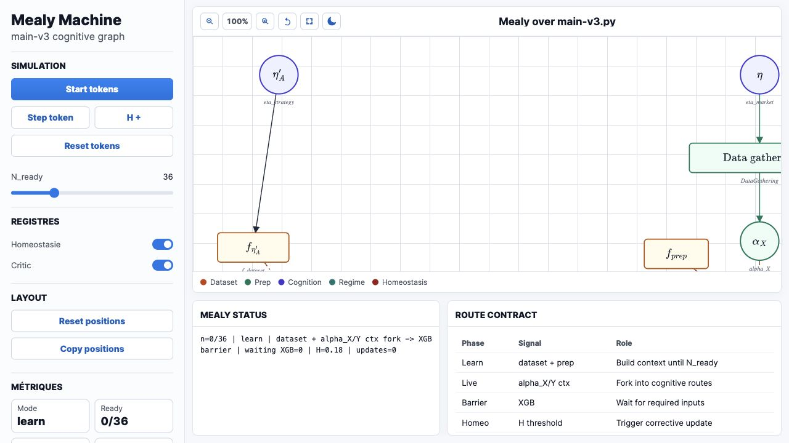

# Mealy Machine Visualizer

Standalone browser interface for exploring a Mealy-machine-style view over `main-v3.py`, with state diagrams, formulas, and interaction panels.

## Live Demo

[Open the Vercel deployment](https://mealy-pi.vercel.app)



## Features

- Visualizes state-machine structure and transitions.
- Includes MathJax-rendered formulas and analysis panels.
- Provides local controls for exploring the diagram and supporting tables.
- Single-file static app, deployable without a backend.

## Run Locally

```bash
python3 -m http.server 8777
```

Then open:

```text
http://localhost:8777
```

## Project Structure

```text
index.html       Full standalone visualizer
docs/            README screenshot assets
```
